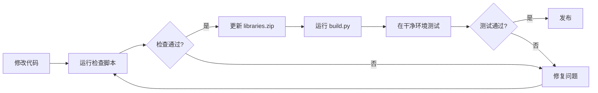

# wzRobot Mind+ 扩展开发完全指南

**版本**: V0.3.9  
**最后更新**: 2026-04-06  
**适用环境**: Mind+ 1.8.04+, Arduino UNO (ATmega328P)

---

## 📋 目录

1. [快速开始](#快速开始)
2. [项目结构](#项目结构)
3. [开发工作流](#开发工作流)
4. [库文件管理](#库文件管理)
5. [常见问题解决](#常见问题解决)
6. [API 参考](#api-参考)
7. [发布检查清单](#发布检查清单)

---

## 快速开始

### 环境要求

- **Mind+**: 1.8.04 或更高版本
- **Python**: 3.6+（用于构建脚本）
- **操作系统**: Windows（当前测试环境）

### 安装扩展

1. 下载 `wzRobot-V0.3.8.mpext`
2. 打开 Mind+ → 扩展 → 导入扩展
3. 选择 `.mpext` 文件
4. 重启 Mind+

### 测试安装

```blocks
当启动时
  五路循迹初始化IIC接口
  RGB超声波 初始化 信号引脚 [2] RGB引脚 [3]
  Sentry2 初始化 I2C 地址 [0x60]
  电机驱动板 初始化
```

编译并上传，应该无错误。

---

## 项目结构

```
wzRobot-yiqichuangv0.3.6/
├── arduinoC/                    # Mind+ 扩展源码
│   ├── main.ts                  # 积木定义和代码生成
│   ├── _menus/                  # 下拉菜单配置
│   ├── _locales/                # 多语言支持
│   ├── _images/                 # 积木图标
│   └── libraries/               # Arduino 库文件
│       ├── InfraredTracking/    # 五路循迹传感器
│       ├── RgbUltrasonic/       # RGB超声波模块
│       ├── RGB_LED/             # RGB LED控制（依赖库）
│       ├── Sentry-Arduino/      # Sentry2视觉传感器
│       └── Emakefun_MotorDriver/# 电机驱动板
├── build.py                     # 打包脚本
├── check_portability.py         # 可移植性检查工具
├── generate_precompiled.py      # 预编译文件生成工具
├── config.json                  # 扩展配置
└── wzRobot-V0.3.8.mpext        # 生成的扩展包
```

---

## 开发工作流

### 标准开发流程



### 具体步骤

#### 1. 修改代码

- 修改 `main.ts`：调整积木定义或代码生成逻辑
- 修改库文件：更新 `.h` 或 `.cpp` 文件

#### 2. 运行检查脚本

```bash
# 检查库文件完整性
python check_portability.py

# 生成预编译文件（如果修改了库）
python generate_precompiled.py
```

#### 3. 更新 libraries.zip

```powershell
cd arduinoC\libraries
Compress-Archive -Path @("InfraredTracking","RgbUltrasonic","RGB_LED","Sentry-Arduino","Emakefun_MotorDriver") -DestinationPath libraries.zip -Force
```

#### 4. 打包扩展

```bash
python build.py
```

输出：`wzRobot-V0.3.8.mpext`

#### 5. 测试

在**干净的 Mind+ 环境**中测试：
- 卸载旧扩展
- 清理缓存：删除 `%LOCALAPPDATA%\DFScratch\cache`
- 导入新扩展
- 编译测试程序

---

## 库文件管理

### 库文件要求

每个库必须包含：

```
LibraryName/
├── LibraryName.h          # 头文件（必需）
├── LibraryName.cpp        # 源文件（必需）
└── library.properties     # 元数据配置（必需）
```

**重要**：文件必须在**根目录**，不能在 `src/` 子目录！

### library.properties 格式

```properties
name=库名称（与文件夹名一致）
version=1.0.0
author=作者名
sentence=简短描述（一行）
paragraph=详细描述
category=Sensors
url=https://github.com/fan/wzRobot
architectures=*
includes=LibraryName.h
```

**编码要求**：
- ✅ ASCII 编码
- ✅ Windows 换行符（CRLF）
- ❌ 不要使用 UTF-8 BOM

### 预编译文件

Mind+ 需要预编译的 `.o` 文件进行链接。

**生成方法**：

```bash
python generate_precompiled.py
```

**生成的文件位置**：
```
E:\Program Files (x86)\Mind+\Arduino\static\libraries\
├── LibraryName\
│   └── uno\
│       └── LibraryName.cpp.o
```

**何时需要重新生成**：
- ✅ 修改了 `.cpp` 或 `.h` 文件
- ✅ 升级了 Mind+ 版本
- ❌ 只修改了 `main.ts`

**不需要预编译的库**：
- Sentry-Arduino（纯头文件库）

**重要：目录结构必须匹配源文件**

如果库的源文件有子目录结构，预编译文件的目录也必须保持一致：

```
# 示例：Sentry-Arduino 的复杂目录结构
源文件：
  libraries/Sentry-Arduino/src/SentryFactory.cpp
  libraries/Sentry-Arduino/src/hardware/hw_sentry_i2c.cpp
  libraries/Sentry-Arduino/src/protoc/protocol_analysis.cpp

预编译文件（必须保持相同相对路径）：
  static/libraries/Sentry-Arduino/src/uno/SentryFactory.cpp.o
  static/libraries/Sentry-Arduino/src/hardware/uno/hw_sentry_i2c.cpp.o
  static/libraries/Sentry-Arduino/src/protoc/uno/protocol_analysis.cpp.o
```

**generate_precompiled.py 会自动处理这种结构。**

### ⚠️ Sentry-Arduino 特殊情况

**Sentry-Arduino 不能展平！** 必须保留 `src/` 子目录结构。

**原因**：Sentry-Arduino 的头文件中使用了相对路径引用：
```cpp
// sentry_type.h
#include "hardware/hw_conf.h"  // 相对路径
```

如果展平到根目录，这些相对路径会失效。

**正确做法**：
- ✅ 保持 `src/` 目录结构
- ✅ 不要将 src/ 中的文件复制到根目录
- ✅ Mind+ 可以正确识别带 src/ 结构的库

**错误做法**：
- ❌ 展平 Sentry-Arduino 库
- ❌ 删除 src/ 目录

---

## 常见问题解决

### 问题1: 头文件找不到

**错误**：
```
fatal error: XxxLibrary.h: No such file or directory
```

**原因**：库文件未安装到 Mind+ 全局目录

**解决**：
```powershell
# 从源码复制到全局目录
Copy-Item "arduinoC\libraries\XxxLibrary\*" `
  "E:\Program Files (x86)\Mind+\Arduino\libraries\XxxLibrary\" `
  -Recurse -Force

# 展平 src/ 目录（如果有）
if (Test-Path "...\XxxLibrary\src") {
    Copy-Item "...\XxxLibrary\src\*" "...\XxxLibrary\" -Force
    Remove-Item "...\XxxLibrary\src" -Recurse -Force
}

# 清理缓存
Remove-Item "$env:LOCALAPPDATA\DFScratch\cache" -Recurse -Force
```

### 问题2: library.properties 解析错误

**错误**：
```
Missing '{0}' from library in {1}
```

**原因**：文件格式或编码不正确

**解决**：
```powershell
# 重新创建文件（ASCII编码，CRLF换行）
$props = "name=XxxLibrary`r`nversion=1.0.0`r`nauthor=fan`r`nsentence=Description`r`ncategory=Sensors`r`nurl=https://github.com/fan/wzRobot`r`narchitectures=*`r`nincludes=XxxLibrary.h"
$props | Out-File -FilePath "...\library.properties" -Encoding ASCII -NoNewline
```

### 问题3: 链接时找不到 .o 文件

**错误**：
```
avr-gcc: error: ...XxxLibrary.cpp.o: No such file or directory
```

**解决**：
```bash
python generate_precompiled.py
```

或手动编译：
```powershell
$avrGcc = "E:\Program Files (x86)\Mind+\Arduino\hardware\tools\avr\bin\avr-gcc.exe"
& $avrGcc -c -g -Os -w -std=gnu++11 -fpermissive -fno-exceptions `
  -ffunction-sections -fdata-sections -fno-threadsafe-statics `
  -MMD -flto -mmcu=atmega328p -DF_CPU=16000000L -DARDUINO=10804 `
  -DARDUINO_AVR_UNO -DARDUINO_ARCH_AVR `
  -I "...\cores\arduino" `
  -I "...\variants\standard" `
  -I "...\libraries\XxxLibrary" `
  "...\XxxLibrary.cpp" `
  -o "...\static\libraries\XxxLibrary\uno\XxxLibrary.cpp.o"
```

### 问题4: API 不匹配

**错误**：
```
no matching function for call to 'XxxClass::XxxMethod(...)'
```

**原因**：`main.ts` 生成的代码与库的实际 API 不符

**解决**：
1. 检查库的头文件，确认正确的函数签名
2. 修改 `main.ts` 中的代码生成逻辑
3. 重新打包扩展

**示例**（RGB超声波设置颜色）：
```typescript
// ❌ 错误：调用了不存在的方法
Generator.addCode(`rgbUltrasonic.SetRgbColor(${r}, ${g}, ${b});`);

// ✅ 正确：使用实际存在的方法
Generator.addCode(`rgbUltrasonic.SetRgbEffect(0, ${r}, ${g}, ${b});`);
```

### 问题5: Mind+ 占用文件无法写入

**错误**：
```
can't write to cpp file
```

**原因**：Mind+ 正在运行并锁定了文件

**解决**：
1. 完全关闭 Mind+
2. 检查任务管理器，确保没有 Mind+ 进程
3. 再执行文件操作

---

## API 参考

### 五路循迹传感器 (InfraredTracking)

```typescript
// 初始化
五路循迹初始化IIC接口

// 读取数据
五路循迹读取数据

// 获取状态（0-31，5位二进制）
五路循迹获取状态

// 读取模拟值（0-255）
五路循迹读取通道 [1-5] 模拟值
```

**I2C 地址**: `0x50`

---

### RGB超声波模块 (RgbUltrasonic)

```typescript
// 初始化
RGB超声波 初始化 信号引脚 [2] RGB引脚 [3]

// 获取距离（cm）
RGB超声波 获取距离 cm

// 设置颜色（R/G/B: 0-255）
RGB超声波 设置颜色 红[255] 绿[0] 蓝[0]

// 设置灯效
RGB超声波 设置灯效 [关闭/常亮/呼吸/闪烁/流水/彩虹]

// 关闭灯光
RGB超声波 关闭灯光
```

**硬件接口**：PH2.0 4pin (VCC, GND, I/O, RGB)

---

### Sentry2 视觉传感器 (Sentry-Arduino)

```typescript
// 初始化
Sentry2 初始化 模式 [I2C] 地址 [0x60]

// 启用视觉算法
Sentry2 启用 [色块/AprilTag/学习识别/卡片/人脸/20分类/二维码]

// 获取检测结果数量
Sentry2 获取 [色块] 检测数量

// 获取对象信息
Sentry2 获取 [色块] 第 [1] 个 [X坐标/Y坐标/宽度/高度/标签]
```

**支持的模式**：
- I2C（默认地址 0x60-0x63）
- 软串口 1-4

**支持的视觉算法**：
- 颜色识别
- 色块检测
- AprilTag
- 线条检测
- 学习识别
- 卡片识别
- 人脸识别
- 20分类物体识别
- 二维码识别
- 运动检测

---

### 电机驱动板 (Emakefun_MotorDriver)

```typescript
// 初始化
电机驱动板 初始化

// 控制电机
电机 [M1-M4] 以 [速度 -255~255] 运行

// 控制舵机
舵机 [S1-S8] 转到 [角度 0-180]

// 读取编码器
编码器 [1-4] 计数值

// PID 控制
设置电机 [M1-M4] PID 参数 P[1.0] I[0.0] D[0.0]
```

---

## 发布检查清单

在发布新版本前，逐项检查：

### 代码检查

- [ ] `main.ts` 语法正确，无 TypeScript 错误
- [ ] 所有积木都有对应的代码生成逻辑
- [ ] API 调用与库文件匹配
- [ ] 下拉框选项组已在 `_menus/` 中定义

### 库文件检查

- [ ] 所有库文件完整（.h + .cpp + library.properties）
- [ ] 文件在根目录，不在 src/ 子目录
- [ ] library.properties 格式正确（ASCII 编码，CRLF 换行）
- [ ] 运行 `check_portability.py`，全部通过

### 预编译文件检查

- [ ] 运行 `generate_precompiled.py`，全部成功
- [ ] 所有 .o 文件存在于 `static/libraries/*/uno/`
- [ ] Sentry-Arduino 不需要 .o 文件（纯头文件库）

### 打包检查

- [ ] 更新了 `libraries.zip`
- [ ] 运行 `build.py`，成功生成 `.mpext`
- [ ] 版本号已更新（config.json 和文件名）

### 测试检查

- [ ] 在干净的 Mind+ 环境中测试
- [ ] 所有模块的积木都能正常编译
- [ ] 上传到 Arduino 能正常运行
- [ ] 无编译警告和错误

### 文档检查

- [ ] 更新了本文档
- [ ] 记录了重要的变更
- [ ] 更新了版本号

---

## 附录

### A. 自动化工具说明

#### check_portability.py

**用途**：检查库文件完整性和可移植性

**用法**：
```bash
python check_portability.py
```

**输出**：
- 每个库的文件检查结果
- 缺失文件提示
- 自动修复建议
- 生成 `可移植性检查报告.md`

#### generate_precompiled.py

**用途**：为 Arduino 库生成预编译 .o 文件

**用法**：
```bash
python generate_precompiled.py
```

**配置**：编辑脚本中的 `libraries` 字典添加新库

**输出**：
- 每个库的编译进度
- 生成的 .o 文件大小
- 编译错误详情（如果有）

#### build.py

**用途**：打包 Mind+ 扩展

**用法**：
```bash
python build.py
```

**输出**：`wzRobot-V{version}.mpext`

---

### B. 文件位置速查

| 文件类型 | 位置 |
|---------|------|
| 扩展源码 | `arduinoC/` |
| 库文件（开发） | `arduinoC/libraries/` |
| 库文件（Mind+） | `E:\Program Files (x86)\Mind+\Arduino\libraries\` |
| 预编译文件 | `E:\Program Files (x86)\Mind+\Arduino\static\libraries\` |
| Mind+ 缓存 | `%LOCALAPPDATA%\DFScratch\cache\` |
| Mind+ 构建 | `%LOCALAPPDATA%\DFScratch\build\` |
| 扩展包 | `wzRobot-V*.mpext` |

---

### C. 常用 PowerShell 命令

```powershell
# 清理缓存
Remove-Item "$env:LOCALAPPDATA\DFScratch\cache" -Recurse -Force
Remove-Item "$env:LOCALAPPDATA\DFScratch\build" -Recurse -Force

# 复制库文件
Copy-Item "source\*" "destination\" -Recurse -Force

# 压缩库文件
Compress-Archive -Path @("Lib1","Lib2") -DestinationPath libraries.zip -Force

# 检查文件是否存在
Test-Path "path\to\file"

# 查看目录内容
Get-ChildItem "path\to\dir" | Select-Object Name, Length
```

---

### D. 版本历史

| 版本 | 日期 | 主要变更 |
|------|------|---------|
| V0.3.9 | 2026-04-06 | 修复 Sentry-Arduino 和 Emakefun_MotorDriver 预编译文件；完善库管理；更新工具链 |
| V0.3.8 | - | 修复 RGB 超声波 API；完善库文件管理；添加工具链 |
| V0.3.6 | - | 初始版本 |

---

## 🎯 快速故障排除

遇到编译错误？按以下步骤排查：

1. **检查错误类型**
   - `No such file or directory` → 库文件未安装
   - `Missing '{0}' from library` → library.properties 问题
   - `No such file or directory (.o)` → 缺少预编译文件
   - `no matching function` → API 不匹配

2. **运行检查脚本**
   ```bash
   python check_portability.py
   python generate_precompiled.py
   ```

3. **清理缓存**
   ```powershell
   Remove-Item "$env:LOCALAPPDATA\DFScratch\cache" -Recurse -Force
   ```

4. **重启 Mind+ 并重试**

---

**祝开发顺利！** 🚀

如有问题，请查看具体的错误信息并参考相应的解决章节。
